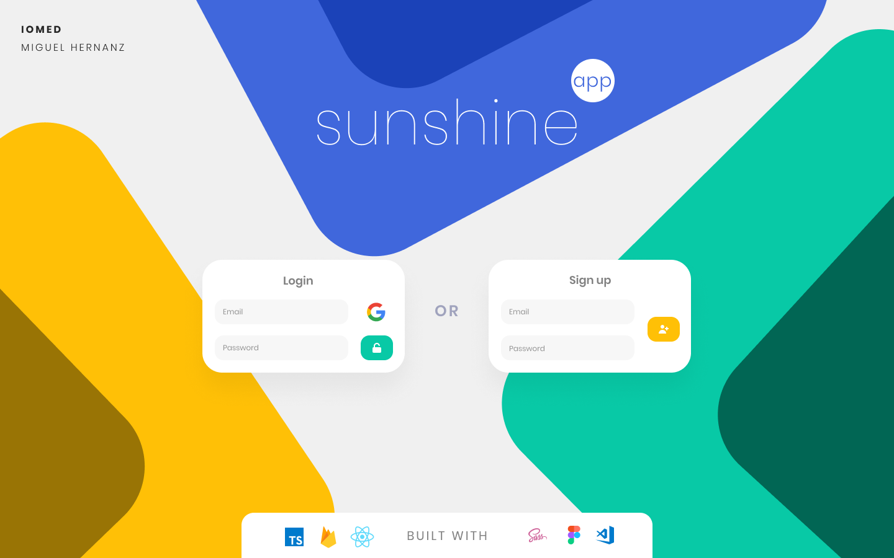
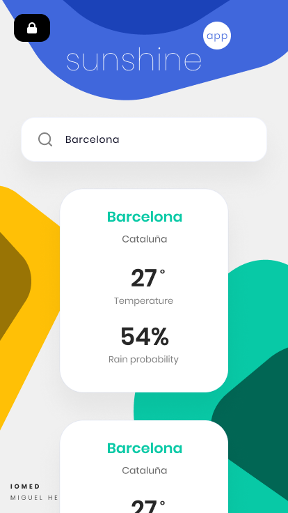

<h1 align="center">
  IOMED Sunshine app
</h1>



React app built in Typescript that allows user to fetch weather data.
[IOMED](https://iomed.es/) assessment.

---
Features

1. **Stack.** Typescript, React, styled-components.
2. **Interface.** Own [design](https://www.figma.com/file/L09AYG8lpH6giHCH1Mb4nC/sunshineapp) built with `figma`.
3. **Firebase service:** Firebase user authentication.

<p align="center">
  
</p>


## Issues

[API](https://www.el-tiempo.net/api) doesn't work in neither of v1 or v2 while searching for an especific town. 

> To fix this, I introduced OpenWeatherApi instead for consulting.


Links:

- [`OpenWeatherApi`](https://openweathermap.org/current)
- [`Elastic UI EuiComboBox`](https://elastic.github.io/eui/#/forms/combo-box)


## Install
```shell
yarn install 
```

## Usage

With [yarn](https://npmjs.org/) installed, run

```shell
yarn start 
```
    
To build

```shell
yarn build 
```

## What I will implement soon

As I've really enjoyed this project, I want to keep creating/improving some features:

- [ ] [React Select](https://react-select.com/home) select instead of [EuiComboBox](https://elastic.github.io/eui/#/forms/combo-box).
- [ ] Implement firestore workflow.
- [ ] Improve design.
- [ ] Deploy it.

## Author

Miguel Hernanz de Castro
